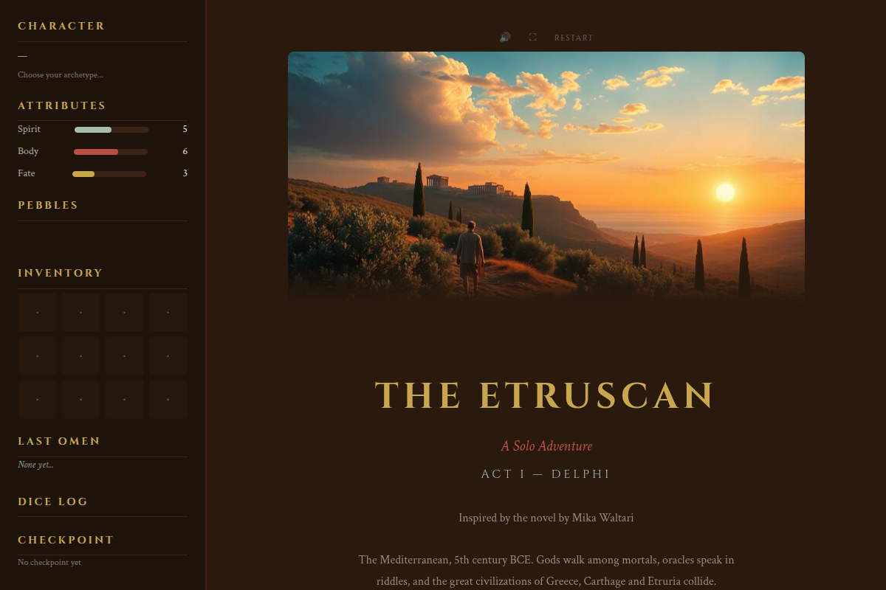
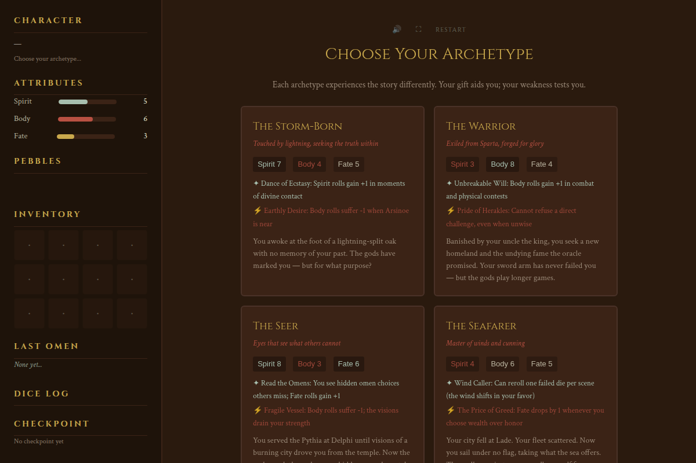
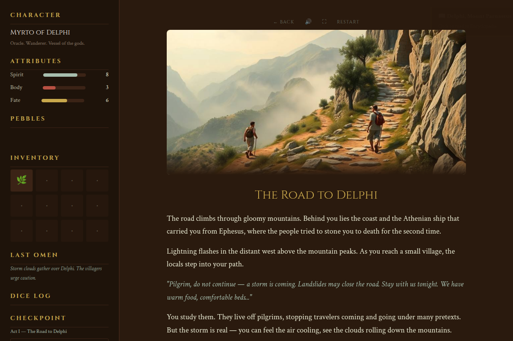
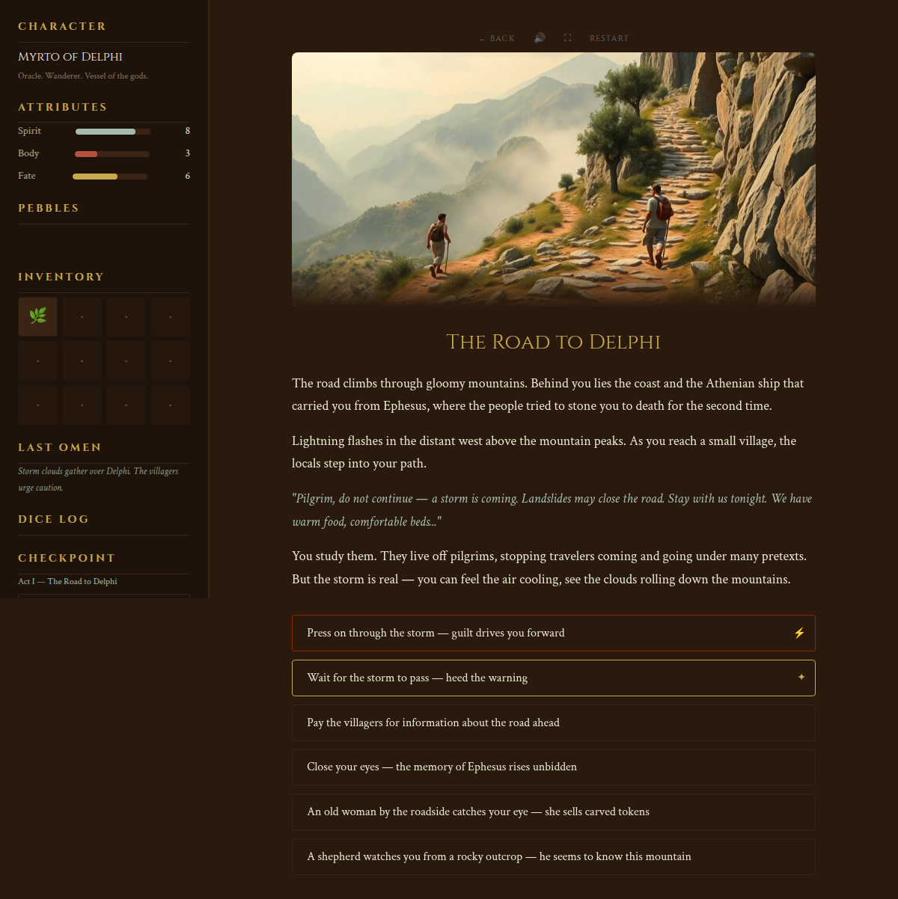
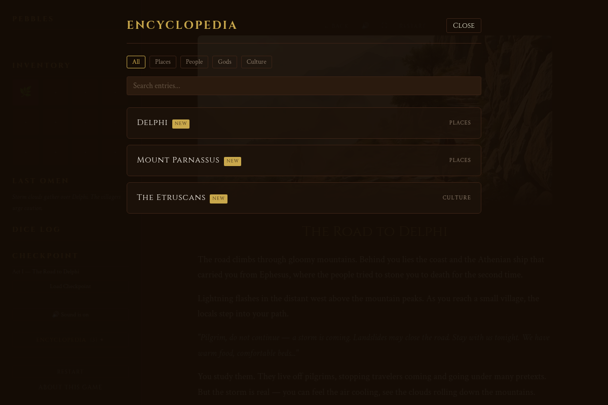

# The Etruscan — An Interactive Fiction Adventure

> *The Mediterranean, 5th century BCE. Gods walk among mortals, oracles speak in riddles, and the great civilizations of Greece, Carthage and Etruria collide.*

**[Play Now](https://theetruscanif.vercel.app)** | [Download](https://github.com/miraculix95/the_etruscan_if/raw/main/dist/index.html) (single HTML file, works offline)

---

## Screenshots

| | |
|---|---|
|  |  |
| *Four character classes with unique abilities* | *Illustrated scenes with branching narrative* |
|  |  |
| *Omen and defy choices shape your story* | *Unlockable encyclopedia with lore entries* |

## Features

- **111 scenes** across Act I with branching paths, side quests, and skill checks
- **4 character classes** — Storm-Born, Warrior, Seer, Seafarer — each with unique abilities and weaknesses
- **87 illustrated scenes** (AI-generated via Flux/Replicate)
- **Dice-based skill system** — 2d6 rolls against Spirit, Body, and Fate attributes
- **Pebble economy** — collect inscribed stones at turning points that record your choices
- **Omen/Defy system** — follow the gods' signs or defy them; neither is wrong, but the balance shapes your ending
- **Encyclopedia** — unlockable lore entries for characters, places, gods, and cultures
- **Inventory system** — collect and use story items
- **Sound effects** (AI-generated via ElevenLabs)
- **Checkpoint saves** — resume where you left off
- **Single HTML file** (8 MB) — zero dependencies, works offline, runs in any browser

## How to Play

Open `index.html` in any modern browser. No server, no installation, no dependencies.

Or **[play online](https://theetruscanif.vercel.app)** — the game is hosted on Vercel.

## Built With

This game was built as a human-AI collaboration:

- **Text & logic:** Claude (Anthropic)
- **Illustrations:** Flux via Replicate
- **Sound effects:** ElevenLabs
- **Creative direction:** Human

## License

MIT License. See [LICENSE](LICENSE) for details.

The game's narrative is inspired by Mika Waltari's *The Etruscan* (1955). The novel remains under copyright until 2050 (EU: life + 70 years; Waltari d. 1979). This game is an original interactive work, not a reproduction of the novel.

## Author

Bastian Brand — March 2026
